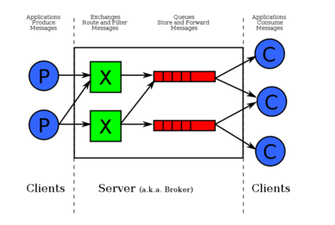

## RabbitMQ

### introduce

- 简介:
  RabbitMQ 开源消息队列系统, 是 `AMQP(Advanced Message Queuing Protocol)` 的标准实现, 用 erlang 语言开发.
- 优点:
  RabbitMQ 性能好、时效性、集群和负载部署; 适合较大规模的分布式系统.
- 组成元素
  1. 生产者
  2. 交换机: 接收相应的消息并且绑定到指定的队列
  3. 消息队列: 持久化问题
  4. 消费者
  5. vrtual hosts: 虚拟主机[数据库]
- 工作流程
  

### install on linux os

```shell
# 1. 首先必须要有Erlang环境支持
apt-get install erlang-nox

# 2. 添加公钥
sudo wget -O- https://www.rabbitmq.com/rabbitmq-release-signing-key.asc | sudo apt-key add -
apt-get update

# 3. 安装 RabbitMQ
apt-get install rabbitmq-server  #安装成功自动启动

# 4. 查看 RabbitMQ 状态
systemctl status rabbitmq-server

# 5. web 端可视化
rabbitmq-plugins enable rabbitmq_management   # 启用插件
service rabbitmq-server restart # 重启

# 6. 添加用户
rabbitmqctl list_users
rabbitmqctl add_user admin yourpassword   # 增加普通用户
rabbitmqctl set_user_tags admin administrator    # 给普通用户分配管理员角色

# 7. 管理
service rabbitmq-server start    # 启动
service rabbitmq-server stop     # 停止
service rabbitmq-server restart  # 重启
```

### 交换机: 接收相应的消息并且绑定到指定的队列

- 分为 4 类: Direct、topic、headers、Fanout

  1. Direct 默认的交换机模式[最简单]: 即 发送者发送消息时指定的 `key` 与创建队列时指定的 `BindingKey` 一样时, 消息将会被发送到该消息队列中.
  2. topic 转发信息主要是依据 `通配符`, 发送者发送消息时指定的 `key` 与 `队列和交换机的绑定时` 使用的 `依据模式(通配符+字符串)` 一样时, 消息将会被发送到该消息队列中.
  3. headers 是根据 `一个规则进行匹配`, 而发送消息的时候 `指定的一组键值对规则` 与 在消息队列和交换机绑定的时候会指定 `一组键值对规则` 匹配时, 消息会被发送到匹配的消息队列中.
  4. Fanout 是 `路由广播` 的形式, 将会把消息发给绑定它的全部队列, 即便设置了 key, 也会被忽略 `[相当于发布订阅模式]`.

### RabbitMQ 模式

1. 单一模式: 单实例服务
2. 普通模式: 默认的集群模式

   - 在没有 `policy` 时, QUEUE 会默认创建集群:

     1. 消息实体只存在与其中的节点, A、B 两个节点仅具有相同的元数据[队列结构], 但是队列的元数据只有一份在创建该队列的节点上; 当 A 节点宕机之后可以去 B 节点查看; 但是声明的 exchange 还在.
     2. msg 进入 A 节点, consumer 却从 B 节点获取: RabbitMQ 会临时在 A、B 间进行消息传输, 把 A 中的消息实体取出并经过 B 发送给 consumer
     3. consumer 应尽量连接每一个节点, 从中取消息
     4. 同一个逻辑队列, 要在多个节点建立物理 Queue

   - 缺点:
     1. A 节点故障后, B 节点无法取到 A 节点中还未消费的消息实体
     2. 做了消息持久化, 那么得等 A 节点恢复, 然后才可被消费；
     3. 如果没有持久化的话, 队列数据就丢失了

3. 镜像模式: 把需要的队列做成镜像队列, 存在于多个节点, 属于 RabbitMQ 的 HA 方案

   - 消息实体会主动在镜像节点间同步, 而不是在 consumer 取数据时临时拉取
   - policy 进行配置: ha-mode、ha-params
     | ha-mode| ha-params| introduce|
     |:--:|:--:|:--:|
     |all|absent| 镜像到集群内的所有节点|
     |exactly|count| 镜像到集群内指定数量的节点:|
     |||集群内该队列的数量少于这个数 count, 则镜像到所有节点;|
     |||集群内该队列的数量多于这个数 count, 且包含一个镜像的停止节点, 则不会载其他节点上镜像|
     |nodes|node name| 镜像到指定节点. 该指定节点不能存在与集群中时报错;|
     |||如果没有指定节点, 则队列会被镜像到发起声明的客户端所连接的节点上.|
   - 缺点
     1. 降低性能
     2. 消耗带宽

#### 集群 HA

1. RabbitMQ 集群节点: 内存节点、磁盘节点
   - 投递消息时, 打开了消息的持久化, 那么即使是内存节点, 数据还是安全的放在磁盘
2. 一个 rabbitmq 集群中可以共享 user, vhost, queue, exchange
   - 所有的数据和状态都是必须在所有节点上复制的`[除外:只属于创建它的节点的消息队列]`
   -
